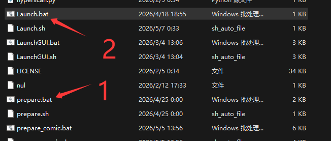

# AiNiee-Next 图文快速上手教程

本教程按 `README_IMG` 中的截图编号编写，适合第一次使用 AiNiee-Next 的用户快速完成：克隆项目、准备环境、配置 DeepSeek API、调整项目设置、选择提示词并开始翻译。

> 示例环境为 Windows + DeepSeek。其他在线 API 的入口类似，但 API Key、模型名称、API 地址和 SDK 兼容性设置请以对应平台要求为准。
> 这里选择 DeepSeek 做示范，主要是因为它价格便宜、效果够用、速度和稳定性也比较适合新手入门。它不是唯一选择；熟悉流程后，你也可以换成 OpenAI、Claude、Gemini 或其他兼容平台。

## 开始前：为什么本教程先教 CLI/TUI，而不是 WebUI

AiNiee-Next 有 CLI/TUI 和 WebUI 两种常用操作入口。这里先教 CLI/TUI，并不是因为 WebUI 不能用，也不是因为 WebUI 不重要，而是因为第一次使用时，CLI/TUI 更适合新手把完整流程跑通。

CLI/TUI 就是双击 `Launch.bat` 后看到的控制台菜单。它看起来是黑色窗口，但不用害怕，它不是让你写代码，而是按编号一步一步选择。第一次配置时，你只需要跟着菜单依次完成语言、API、项目设置、提示词和翻译任务，流程非常线性。

WebUI 的优势是直观、适合查看进度、管理队列和局域网远程访问。但完全新手第一次打开 WebUI 时，可能会看到很多页面和按钮，却不知道第一步应该点哪里。尤其是还没有配置 API Key、模型、输入输出路径和提示词时，直接从 WebUI 开始反而容易迷路。

因此本教程建议：

- **第一次使用**：先按本文使用 CLI/TUI 跑通一次翻译。
- **已经跑通过一次后**：再使用 WebUI 查看进度、管理队列、切换 Profile 或远程监控。
- **人在公司、学校、图书馆，或主机放在家里、宿舍、服务器上**：WebUI 很适合在局域网内用另一台设备查看任务状态。

简单说，CLI/TUI 适合第一次配置和跑通流程，WebUI 适合后续监控和远程管理。等你理解了基本流程，再用 WebUI 会更顺手。

## 1. 使用 Git 克隆项目

请优先使用 Git 克隆项目，而不是直接下载 ZIP 压缩包。这样后续更新更方便。

如果电脑还没有安装 Git，请先安装 [Git for Windows](https://git-scm.com/download/win)。安装完成后，选择一个你想存放项目的目录，在空白处右键打开终端，执行：

```powershell
git clone https://github.com/ShadowLoveElysia/AiNiee-Next.git
cd AiNiee-Next
```

克隆完成后，打开 `AiNiee-Next` 项目根目录。Windows 用户主要会用到根目录中的 `prepare.bat` 和 `Launch.bat`。

<p align="center">
  
  <br>
  <sub>图 1：使用 Git 克隆项目后，在项目根目录中找到 prepare.bat 与 Launch.bat。</sub>
</p>

## 2. 准备运行环境

首次运行前，双击 `prepare.bat`。脚本会检查 `uv`、创建虚拟环境并安装依赖。

<p align="center">
  
  <br>
  <sub>图 2：prepare.bat 会自动检查 uv、创建虚拟环境并安装依赖。</sub>
</p>

看到类似 `Environment is ready. You can now use Launch.bat to start AiNiee CLI.` 的提示后，说明环境准备完成。此时按任意键退出准备脚本。

<p align="center">
  
  <br>
  <sub>图 3：出现 Environment is ready 后，环境准备完成。</sub>
</p>

## 3. 启动 AiNiee CLI

环境准备完成后，双击 `Launch.bat` 启动主程序。

进入主程序后，如果提示未检测到 Web 编译包，只使用 CLI/TUI 翻译时可以先输入 `0` 跳过。这里跳过的只是 WebUI 编译包，不影响本教程继续完成 API 配置和翻译任务。后续需要 Web 面板时，再按提示下载或本地编译 Web 包即可。

<p align="center">
  
  <br>
  <sub>图 4：Launch.bat 进入主程序后，如出现 Web 编译包提示，可以先输入 0 暂时跳过。</sub>
</p>

## 4. 首次向导：选择语言、目标语言和 API

跳过 Web 编译包提示后，第一次进入会出现快速设置向导。可以按下面的示例完成前期选择：

1. 语言选择：`1. 中文（简体）`
2. 源语言：保持 `auto`
3. 目标语言：保持 `Chinese`
4. API 配置：选择 `1. 在线 API（预设）`
5. 在线 API 预设：选择 `5. deepseek`

这些前期选择对应图 5 的上半部分；选择 `deepseek` 后，会进入同一张图下方的 API 编辑区域。

## 5. 填写 DeepSeek API Key 和模型

进入 DeepSeek 配置后，按提示填写 API Key 和模型名称。如果你还没有 API Key，请先阅读：[DeepSeek API Key 申请教程](DEEPSEEK_API_KEY.md)。

API Key 建议尽量使用 `Ctrl+V` 粘贴。由于程序有脱敏保护，粘贴后终端里不会明文显示 Key；只要确认已经粘贴，就可以继续下一步选择或填写模型。

<p align="center">
  
  <br>
  <sub>图 5：API Key 粘贴后不会明文显示，继续填写模型名称即可。</sub>
</p>

配置保存后会显示当前平台已激活。此时可以先选择 `3. 验证当前 API` 做一次连通性测试。

<p align="center">
  
  <br>
  <sub>图 6：保存 API 配置后，先验证当前 API。</sub>
</p>

## 6. DeepSeek 验证失败时切换 SDK 请求模式

如果出现下图这样的 `HTTP 404 Error`，不一定是 API Key 填错。这里失败的原因通常是默认请求方式仍是 `HTTPX`，而 DeepSeek 在本项目中需要切换到 `OpenAI SDK` 请求模式。

<p align="center">
  
  <br>
  <sub>图 7：DeepSeek 默认 HTTPX 验证失败示例。</sub>
</p>

按回车返回后，在主菜单输入 `7` 进入 **API 配置**。

<p align="center">
  
  <br>
  <sub>图 8：主菜单中选择 7，进入 API 配置。</sub>
</p>

在 API 配置菜单中选择 `5. SDK 请求模式`。该项会按 `HTTPX -> OpenAI SDK -> Anthropic SDK -> HTTPX` 循环切换；DeepSeek 这里切到 `OpenAI SDK` 即可。`Anthropic SDK` 表示使用 Anthropic 协议，不限定 Claude 模型。

<p align="center">
  
  <br>
  <sub>图 9：选择 5，将请求方式改为 OpenAI SDK。</sub>
</p>

修改完成后，选择 `3. 验证当前 API`。如果出现 `msg_api_ok` 且返回正常回复，说明当前 API 已经可用。验证成功后按 `0` 返回主菜单。

<p align="center">
  
  <br>
  <sub>图 10：出现 msg_api_ok 和正常回复，表示 API 可用。</sub>
</p>

## 7. 配置项目设置

回到主菜单后，输入 `6` 进入 **项目设置**。

常用配置可以参考图 11 和图 12，包括输入/输出路径、源语言、目标语言、Token 限制、每次翻译行数、请求超时、线程数、格式转换、漏翻检查和高级设置等。

<p align="center">
  
  <br>
  <sub>图 11：项目设置上半部分，重点关注路径、语言和翻译参数。</sub>
</p>

继续向下可以看到 API 请求、漏翻检测、自动化设置和高级设置。

如果使用 DeepSeek，线程数可以根据账号额度、网络稳定性和机器性能改为 `50` 或 `75`，建议先从较稳的数值开始，再逐步上调。

如果所用模型支持 `xhigh` 或 `max` 这类思考深度，可以按平台能力配置；DeepSeek 建议设置为 `max`。截图中为了演示，思考深度设置为 `高`。

<p align="center">
  
  <br>
  <sub>图 12：项目设置下半部分，可配置 OpenAI SDK、线程数、思考深度等高级选项。</sub>
</p>

配置完成后按 `0` 返回主菜单。

## 8. 选择并应用提示词

回到主菜单后，进入 **术语表与提示词设置**，选择提示词模板。

下图示例选择默认提示词中的 `common_system_zh.txt`。预览确认后，选择 `1. 应用此提示词`，然后返回主菜单。

<p align="center">
  
  <br>
  <sub>图 13：选择 common_system_zh.txt，确认后应用此提示词。</sub>
</p>

## 9. 开始翻译

回到主菜单后输入 `1`，开始翻译任务。

下图以《超时空辉夜姬》的 EPUB 文件作为演示。你可以输入文件索引、完整路径，或按提示输入 `q` 退出选择。

<p align="center">
  
  <br>
  <sub>图 14：输入文件路径或文件索引，选择要翻译的文件。</sub>
</p>

任务启动后会进入实时日志和进度界面。这里可以看到当前文件、进度、线程数、RPM、TPM、成功率、错误率和预计耗时。

如果翻译过程中达到自动扩展/自动重试限制，也就是达到限制次数后依然持续报错，程序可能会强制退出。此时可以尝试重新翻译同一个文件，利用已有缓存和断点继续补全未翻译内容。

<p align="center">
  
  <br>
  <sub>图 15：任务已经开始翻译，等待进度完成即可。</sub>
</p>

## 10. 查看翻译结果

出现任务总结报告后，本次翻译任务已经完成。终端会显示输入文件和输出目录，用户可以前往对应输出目录查看成品。

<p align="center">
  
  <br>
  <sub>图 16：任务完成后，按提示前往输出目录查看结果。</sub>
</p>

下图为本次 EPUB 翻译成果展示。

<p align="center">
  
  <br>
  <sub>图 17：翻译后的 EPUB 可以用电子书阅读器打开查看。</sub>
</p>

## 继续探索

AiNiee-Next 还有项目配置、提示词、术语表、任务队列、WebServer、MCP 服务、插件等更多功能可以继续探索。

如果你已经跑通了第一次翻译，想进一步提升翻译质量，可以继续阅读：[提示词、术语表、润色与软件设置教程](TRANSLATION_WORKFLOW_GUIDE.md)。

如果你有新的好建议，或找到了 Bug，欢迎提交 [Issue](https://github.com/ShadowLoveElysia/AiNiee-Next/issues) 与开发者分享和讨论。
